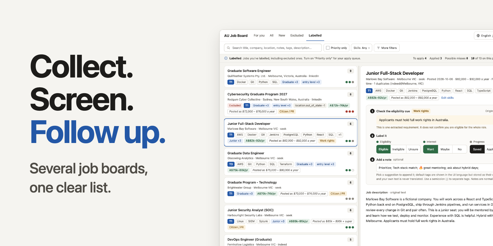
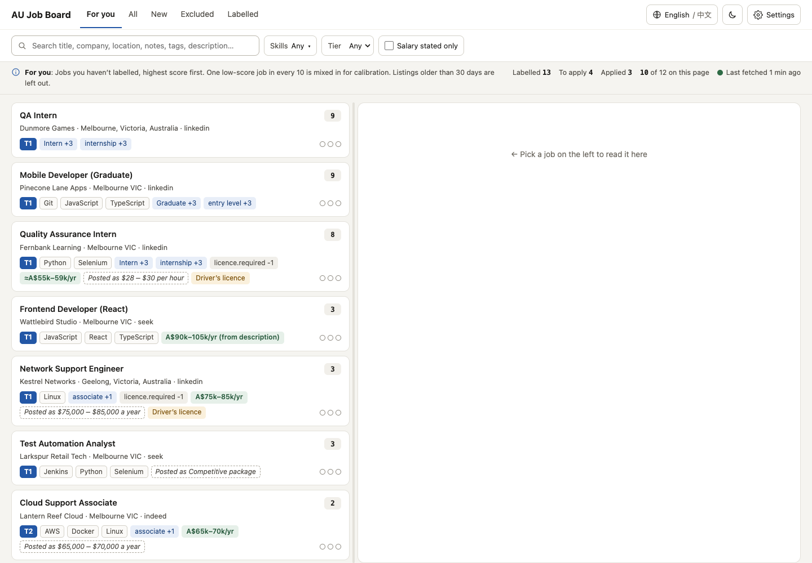
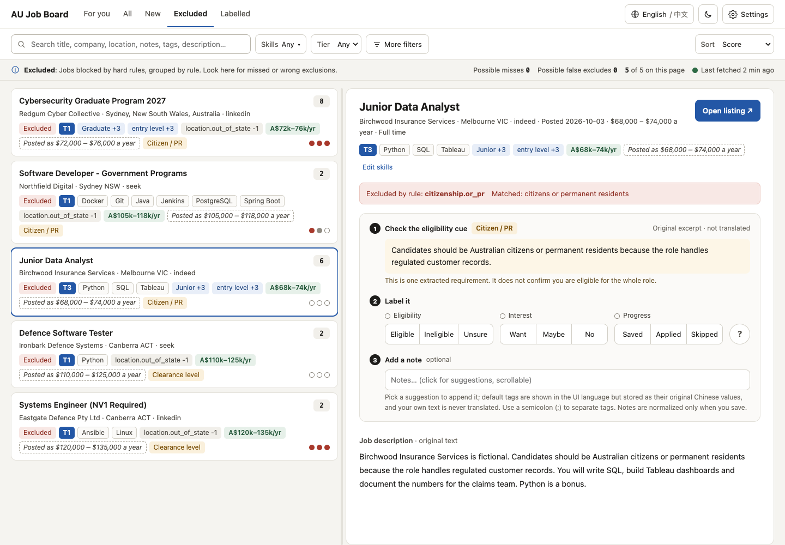
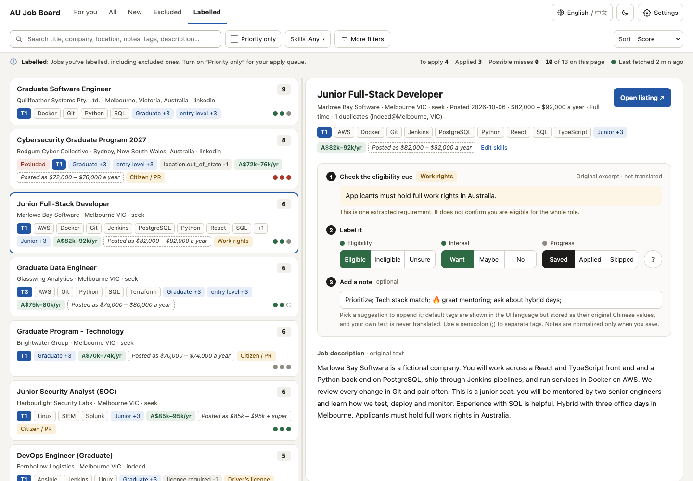

<p align="center">
  
</p>

# AU Job Pipeline

English · [简体中文](README.zh-CN.md)

A local tool for people searching for jobs in Australia. It collects listings
from several job boards into one SQLite database on your machine, merges
duplicates, flags hard deal-breakers with the original sentence as evidence,
ranks the rest, and gives you a small web panel to label, annotate and follow up
on the jobs you care about.

It is a first-pass sorting aid. Applying is still your decision, and nothing in
it submits an application for you.

> All screenshots, the banner and the video in this repository show
> hand-written synthetic data. They do not come from real users or real
> listings, and they say nothing about real-world results.

## The problem it addresses

Listings for the same role are scattered across SEEK, Indeed and LinkedIn, often
posted several times with slightly different company names. Requirements that
rule you out, such as citizenship, permanent residency or a security clearance,
are buried in the description. And once you start shortlisting, the decisions
and notes live in your head or in a spreadsheet.

## What it does

- **Collect.** Fetches listings from SEEK and Indeed, and optionally LinkedIn,
  using sources you switch on or off in your own configuration.
- **Keep the original.** Stores each raw job description locally, so rules can be
  changed and re-applied without fetching again.
- **Merge and screen.** Groups cross-platform duplicates, applies a short list of
  narrow hard filters, and records which rule matched and the exact text it
  matched.
- **Rank.** Scores what remains by role direction, level, stated experience and
  salary signals, and tags jobs with technologies from an editable vocabulary.
  Scores order the list; they are not a verdict on you.
- **Read, label and follow up.** The local panel lists jobs in five views
  (Recommended, All, New, Excluded, Labelled), shows the original posting text
  and the evidence sentence, and lets you record eligibility, interest and
  progress (saved, applied, skipped) plus free-form notes. A Priority filter
  lists the jobs whose notes carry the default "Prioritize" tag, giving you an
  apply queue.
- **Report.** Writes CSV and Markdown reports, including an excluded list for
  auditing the hard filters.

The panel is available in English and Chinese, in light and dark themes, and on
desktop and phone-width screens.

## See it

| | |
|---|---|
|  |  |
| Recommended view | An excluded job: the rule that matched and the quoted original sentence |
|  | [](docs/demo-video/product-demo-30s.mp4) |
| A labelled job with status and notes | 30-second walkthrough ([mp4](docs/demo-video/product-demo-30s.mp4)) |

More images are in the [screenshot library](docs/demo-screenshots/README.md)
(102 synthetic screenshots; English and Chinese, light and dark, desktop, tablet
and phone). How the video was made is in [its notes](docs/demo-video/README.md).

## How you would use it

1. **Configure.** Copy `config.example.yaml` to your own `config.yaml`, set your
   search terms, locations and which sources are enabled, and choose a
   `legacy_rule_profile` that matches your situation.
2. **Fetch.** `fetch` collects listings and `details` fills in missing SEEK
   descriptions. These are the only steps that use the network.
3. **Analyze.** `analyze` filters, scores, de-duplicates and extracts skills from
   the stored descriptions. It is offline, so changing rules and re-running takes
   seconds.
4. **Review.** Open the panel, work through the Recommended view, check Excluded
   for anything filtered by mistake, and label and annotate as you go.
5. **Follow up.** Use the Labelled view and the Priority filter, or write a
   report with `report`.

Commands, options and exact behaviour are in the [usage guide](docs/usage.md).
A source installation for a new machine is in the [installation
guide](docs/install.md); an AI coding agent can follow the same steps via
[agent-assisted installation](docs/agent-install.md).

## Try it without fetching anything

The repository includes a synthetic demo: 19 fictional postings, no network, no
scraping, and no access to your own configuration or database. It writes only to
its own directory and serves on `127.0.0.1:8091`. The steps are in the
[demo guide](docs/demo.md).

## Install

The pipeline is installed from source into its own virtual environment. The
steps are in the [installation guide](docs/install.md). Python 3.12 on macOS 15
is what has been checked; other versions and platforms are not verified. Getting
the source and installing dependencies may both use the network; the offline
checks and the synthetic demo do not.

Get the source from the public repository. The final address is not published
yet, so this template uses a placeholder; replace it before running, and do not
run the placeholder literally:

```bash
git clone <PUBLIC_REPOSITORY_URL> au-job-pipeline
cd au-job-pipeline
```

### Agent-assisted installation

An AI coding agent can follow the same steps through the
[agent-assisted installation](docs/agent-install.md) page. Copy this instruction
to the agent:

> Install this project from source following docs/install.md and
> docs/agent-install.md. Get the source from <PUBLIC_REPOSITORY_URL> into a new
> directory I name; if that placeholder is not filled in, ask me for the address
> and do not guess it or use a private remote. Create a project-local virtual
> environment with Python 3.12 and install requirements.txt. Getting the source
> and installing dependencies may both use the network. Keep any existing
> configuration and database untouched. Before guessing any personal setting,
> show me the job keywords, city or region, rule profile and sources options to
> confirm. Verify offline by generating the synthetic demo into a new directory
> that does not exist yet and running the two public tests, then start the normal
> panel only against that generated demo config on 127.0.0.1, confirm the home
> and settings pages answer, and stop it. Report the install path, the start/stop
> commands, which checks passed or failed, and which personal settings are still
> unconfirmed. Once verification and personal configuration are complete, ask
> whether I want a one-off fetch. On macOS, also ask whether I want daily
> automatic updates through launchd and at what local time. Explain that daily
> updates fetch, analyze and write reports. Both options are off unless I
> explicitly choose them; do not treat silence as approval. On other systems,
> do not offer or configure an unverified scheduler by default. Do not expose
> the panel or push anything to GitHub.

## Limits to know about

- **Not a candidate assessment.** Rules are keyword-and-pattern matches on
  English text. They can wrongly exclude a job or wrongly keep one, which is why
  the Excluded view and the audit report exist.
- **Profiles are rule switches, not legal advice.** A profile such as `citizen`,
  `permanent_resident`, `485`, `student_visa` or `custom` only decides which
  existing rules run. Mixed and overlapping rules still have known limits. See
  [rule profiles](docs/legacy-rule-profiles.md).
- **Changing a profile does not update history by itself.** The Settings page
  shows the profile used by the last successful analysis and has no switch. After
  editing the configuration you re-run `analyze` yourself.
- **Sources are unofficial.** SEEK, Indeed and LinkedIn access is best-effort, can
  break when a platform changes, and is subject to each platform's own terms. See
  [safety and sources](docs/safety-and-sources.md).
- **The panel has no authentication.** Keep it on a loopback address.
- **Australian market, English listings.** Sources, rules and vocabulary are
  built for that setting. The interface language does not translate job text.
- **Single user, local data.** Your database, labels, notes and configuration
  stay on your machine and are yours to protect.

## Project status

This repository is **preparing for a possible public release** and is not a
published project. The following are not decided or not verified, and the
documentation does not imply otherwise:

- the final project name and the repository address (the license is now MIT;
  see [License](#license));
- which configuration, rules and vocabulary files a public release will ship;
- installation on a clean machine, checked only as a candidate flow on Python
  3.12 and macOS 15 (15.7.8 during the check; see
  [installation verification](docs/installation-verification.md)); other
  operating systems and Python versions are not verified, and the configured
  offline-test workflow for macOS 15 / Python 3.12 has not been run on GitHub;
- the Git history of the current development checkout, which contains private
  usage data and will not be published as it is.

`requirements.txt` lists the runtime dependencies (`python-jobspy` and `PyYAML`).
The macOS LaunchAgent examples are templates that have only been validated
offline.

## Documentation

| Read | For |
|---|---|
| [Installation](docs/install.md) | Source install for a new machine |
| [Agent-assisted installation](docs/agent-install.md) | The same steps for an AI agent |
| [Usage guide](docs/usage.md) | Workflow, commands, local data, notes, languages |
| [Configuration](docs/public-configuration.md) | Config file, paths, sources, panel settings |
| [Rule profiles](docs/legacy-rule-profiles.md) | The five profiles, per-rule switches, applying a change |
| [Eligibility snapshot](docs/eligibility-profiles.md) | The separate, read-only `eligibility` section |
| [Safety and sources](docs/safety-and-sources.md) | Panel exposure, platform terms, data redistribution |
| [Demo](docs/demo.md) | The offline synthetic demo |
| [Contributing](docs/contributing.md) | Working on the project, tests, data rules |
| [Public tests](docs/public-tests.md) | The curated offline test entry and CI boundary |
| [macOS automation](docs/launchd-examples.md) | LaunchAgent templates |
| [Installation verification](docs/installation-verification.md) | What the candidate install check covered |
| [All documents](docs/README.md) | Index, including maintainer records |

## License

This project is released under the MIT License. See [LICENSE](LICENSE)
(Copyright (c) 2026 SkywingJam). Third-party dependencies keep their own
licenses, and job listing text belongs to the platforms and advertisers that
published it.
