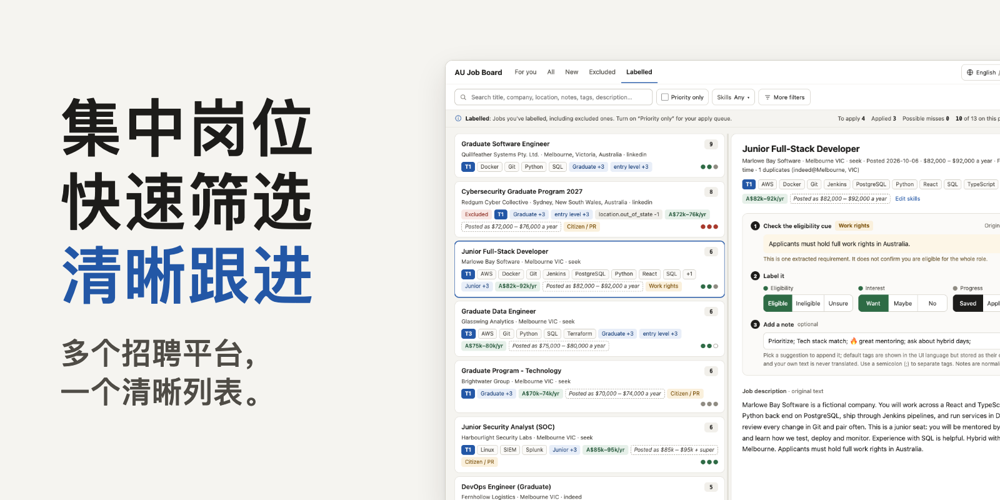
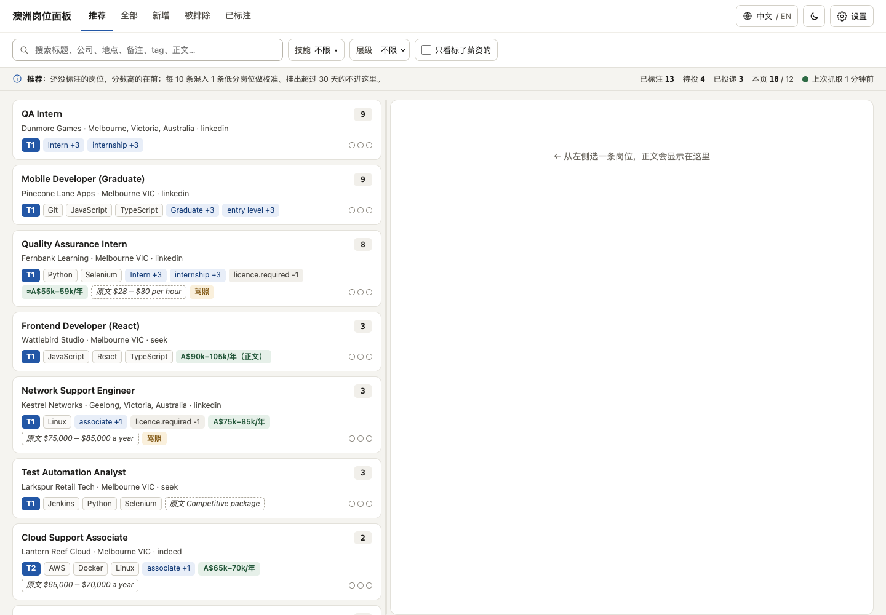
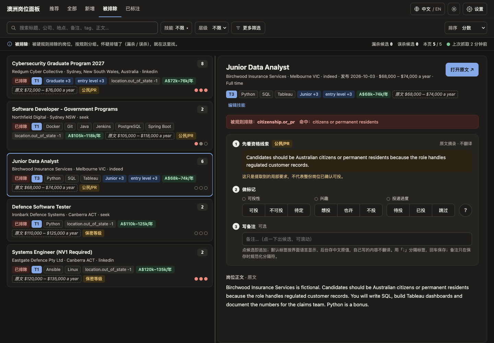
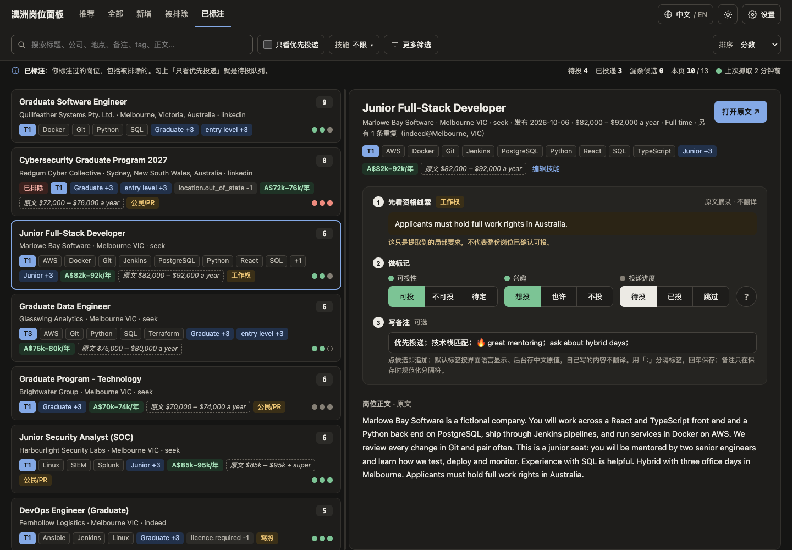
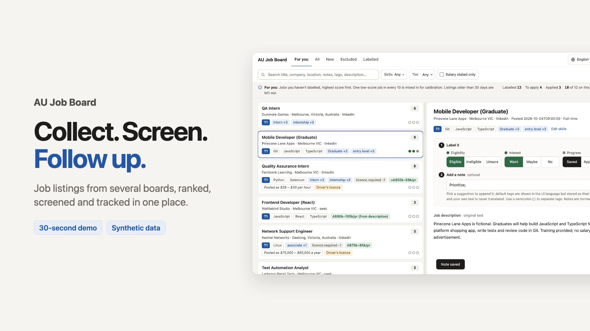

<p align="center">
  
</p>

# AU Job Board

[English](README.md) · 简体中文

一个面向澳洲求职者的本地工具。它把多个招聘平台的岗位收集到你本机的 SQLite
数据库里，合并重复岗位，对硬性门槛标出命中的规则并引用原文句子作为依据，给其余岗位排序，
并提供一个本地网页面板，用来标注、写备注和跟进你关心的岗位。

它只是初筛辅助。是否投递始终由你决定，工具不会替你提交任何申请。

> 本仓库中所有截图、横幅和视频展示的都是手写的合成数据，不来自真实用户或真实岗位，
> 也不代表任何真实效果。

## 解决什么问题

同一个岗位散落在 SEEK、Indeed 和 LinkedIn 上，公司名写法略有不同，常被重复发布。
公民、永久居民、安全审查之类会把你排除在外的要求，埋在岗位描述里。开始筛选之后，
你的判断和备注又只存在脑子里或一张表格里。

## 主要功能

- **收集**：从 SEEK、Indeed 以及可选的 LinkedIn 抓取岗位，各来源可在你自己的配置里单独开关。
- **保留原文**：每个岗位的原始描述保存在本地，调整规则后无需重新抓取即可重算。
- **合并与筛选**：合并跨平台重复岗位，应用一小组收得很窄的硬过滤，并记录命中的规则和匹配到的原文。
- **排序**：按方向、级别、经验要求和薪资信号打分，并用可编辑的词表给岗位打技术标签。
  分数只用于排序，不是对你的评判。
- **阅读、标注与跟进**：本地面板提供「推荐 / 全部 / 新增 / 被排除 / 已标注」五个视图，
  显示岗位原文和证据句，可记录可投性、意向和进度（待投、已投、跳过）以及自由备注。
  「优先投递」筛选会列出备注里带默认标签「优先投递」的岗位，作为待投递队列。
- **报告**：输出 CSV 与 Markdown 报告，其中包含用于核查硬过滤的排除清单。

面板支持中文和英文界面、浅色和深色主题，适配桌面与手机宽度。

## 效果展示

| | |
|---|---|
|  |  |
| 推荐视图 | 被排除岗位：命中的规则和引用的原文句子 |
|  | [](docs/demo-video/product-demo-30s.mp4) |
| 已标注岗位：状态与备注 | 30 秒演示（[mp4](docs/demo-video/product-demo-30s.mp4)；视频界面为英文） |

更多图片见[截图库](docs/demo-screenshots/README.md)（102 张合成数据截图，含中英文、
浅深色、桌面 / 平板 / 手机）。视频的制作方式见[说明](docs/demo-video/README.md)。
截图库和视频说明为英文。

## 大致使用过程

1. **配置**：把 `config.example.yaml` 复制为你自己的 `config.yaml`，设置搜索词、地点和启用的来源，
   并选择符合你情况的 `legacy_rule_profile`。
2. **抓取**：`fetch` 收集岗位，`details` 补齐 SEEK 缺失的描述。只有这两步会联网。
3. **分析**：`analyze` 基于已存的描述做过滤、打分、去重和技能抽取。它不联网，所以改规则后重算只要几秒。
4. **查看**：打开面板，先看推荐视图，到「被排除」里检查有没有误杀，边看边标注、写备注。
5. **跟进**：用「已标注」视图和「优先投递」筛选，或用 `report` 输出报告。

命令、选项和准确行为见[使用指南](docs/usage.md)（英文）。全新机器的源码安装步骤见
[安装指南](docs/install.md)（英文）；AI Agent 可走同一套步骤，见
[Agent 辅助安装](docs/agent-install.md)（英文）。

## 不抓取也能试一试

仓库内含一个合成演示：19 条虚构岗位，不联网、不抓取，也不会读取你自己的配置或数据库，
只写入它自己的目录，并在 `127.0.0.1:8091` 提供服务。步骤见[演示指南](docs/demo.md)（英文）。

## 安装

工具以源码方式安装到独立虚拟环境中。步骤见[安装指南](docs/install.md)（英文）。
目前只在一台机器上实测了 Python 3.12 + macOS 15，其他版本和平台未验证。获取源码和安装依赖都可能需要联网；
离线检查与合成演示不联网。

拟定的仓库地址是 `https://github.com/SkywingJam/au-job-board`，但它**尚未创建或公开**（2026-10-08 查询返回 404）。
在作者公开之前，下面的 clone 命令不会成功；地址失败或不存在不能算作安装结果。如果你已经有源码
（下载或他人提供的副本），直接使用那个目录。仓库公开之后，再克隆到新目录：

```bash
git clone https://github.com/SkywingJam/au-job-board au-job-board
cd au-job-board
```

### Agent 辅助安装

AI Agent 可走同一套步骤，详见 [Agent 辅助安装](docs/agent-install.md)（英文）。把下面的指令
复制给 Agent：

> Install AU Job Board from source following docs/install.md and
> docs/agent-install.md. The intended repository is
> https://github.com/SkywingJam/au-job-board, which may not be
> published yet. Clone it into a new directory I name only if it is reachable;
> if it returns 404, is unreachable or you lack access, report that the source
> is unavailable and ask me for another source, such as a downloaded copy. Do
> not guess another address, use a private remote, or create or publish a
> repository. Create a project-local virtual
> environment with Python 3.12 and install requirements.txt. Getting the source
> and installing dependencies may both use the network. Keep any existing
> configuration and database untouched. Before guessing any personal setting,
> show me the job keywords, city or region, rule profile and sources options to
> confirm. Verify offline by generating the synthetic demo into a new directory
> that does not exist yet and running the two public tests, then start the normal
> panel only against that generated demo config on 127.0.0.1, confirm the home
> and settings pages answer, and stop it. Report the install path, the start/stop
> commands, which checks passed or failed, and which personal settings are still
> unconfirmed. Once verification and personal configuration are complete, ask
> whether I want a one-off fetch. On macOS, also ask whether I want daily
> automatic updates through launchd and at what local time. Explain that daily
> updates fetch, analyze and write reports. Both options are off unless I
> explicitly choose them; do not treat silence as approval. On other systems,
> do not offer or configure an unverified scheduler by default. Do not expose
> the panel or push anything to GitHub.

## 需要了解的限制

- **不是对候选人的评估**：规则是对英文文本的关键词和模式匹配，可能误排除，也可能误保留，
  所以才有「被排除」视图和审计报告。
- **Profile 是规则开关，不是法律结论**：`citizen`、`permanent_resident`、`485`、`student_visa`、
  `custom` 只决定运行哪些既有规则。混合和重叠的规则仍有已知局限。详见
  [规则 profile](docs/legacy-rule-profiles.md)（英文）。
- **改 profile 不会自动更新历史结果**：设置页只显示最近一次成功分析所用的 profile，没有切换开关。
  修改配置后需要你自己重新运行 `analyze`。
- **来源是非官方的**：对 SEEK、Indeed、LinkedIn 的访问是尽力而为，平台变化时可能失效，
  并受各平台自身条款约束。详见[安全与来源](docs/safety-and-sources.md)（英文）。
- **面板没有身份认证**：请只绑定在回环地址上。
- **面向澳洲市场和英文岗位**：来源、规则和词表都是为此设计的；界面语言不会翻译岗位原文。
- **单用户、本地数据**：数据库、标注、备注和配置都留在你的机器上，由你自己负责保护。

## 项目状态

AU Job Board **尚未正式发布**。已经确定并检查过的部分：

- **名称与地址**：项目名为 AU Job Board，拟定仓库为 `https://github.com/SkywingJam/au-job-board`。该仓库尚未创建或公开
  （2026-10-08 查询返回 404），因此没有验证过从它克隆。
- **许可证与范围**：MIT（见[许可证](#许可证)）；公开内容是固定的 296 个文件。
- **干净历史与本机安装检查**：用这些文件建立了只有一个根提交的新历史。2026-10-08 在一台
  macOS 15.8（arm64）机器上，用 Python 3.12.4 和 Node 24.5.0，从它的本地 fresh clone 加全新
  Python 虚拟环境完成了验证：依赖安装、CLI 帮助、只读资格档案、合成演示、合成演示面板，以及全部
  16 项公共离线测试。细节和限制见[安装验证](docs/installation-verification.md)（英文）。

尚未验证，文档不暗示相反的结论：

- 从公开 GitHub 仓库获取源码，以及 GitHub Actions 离线测试工作流（工作流目标是 Node 24.21.0，
  本机检查用的是 24.5.0）；
- 其他操作系统、其他 Python 版本，以及上述那一台机器之外的任何环境；
- 对 SEEK、Indeed、LinkedIn 的真实抓取，以及 macOS LaunchAgent 模板的实际安装（只做过离线验证）；
- 所有资格规则和来源行为。

`requirements.txt` 列出运行依赖（`python-jobspy` 与 `PyYAML`）。

## 文档

目前详细文档均为英文，中文入口以本页为准。

| 阅读 | 内容 |
|---|---|
| [安装指南](docs/install.md) | 全新机器的源码安装 |
| [Agent 辅助安装](docs/agent-install.md) | 供 AI Agent 使用的同一套步骤 |
| [使用指南](docs/usage.md) | 流程、命令、本地数据、备注、语言 |
| [配置说明](docs/public-configuration.md) | 配置文件、路径、来源、面板设置 |
| [规则 profile](docs/legacy-rule-profiles.md) | 五个 profile、逐条规则开关、如何让改动生效 |
| [资格快照](docs/eligibility-profiles.md) | 独立的只读 `eligibility` 配置段 |
| [安全与来源](docs/safety-and-sources.md) | 面板暴露、平台条款、数据再分发 |
| [演示](docs/demo.md) | 离线合成演示 |
| [参与贡献](docs/contributing.md) | 开发、测试与数据规则 |
| [公共测试](docs/public-tests.md) | 公共离线测试入口与 CI 边界 |
| [macOS 自动化](docs/launchd-examples.md) | LaunchAgent 模板 |
| [安装验证](docs/installation-verification.md) | 当前安装验证及其限制 |
| [全部文档](docs/README.md) | 索引（含维护记录） |

## 许可证

本项目以 MIT 许可证发布，见 [LICENSE](LICENSE)（Copyright (c) 2026 SkywingJam）。
第三方依赖保留各自的许可证，岗位原文的权利归发布它的平台和广告主所有。
