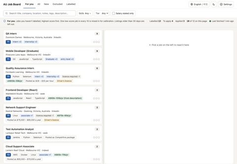
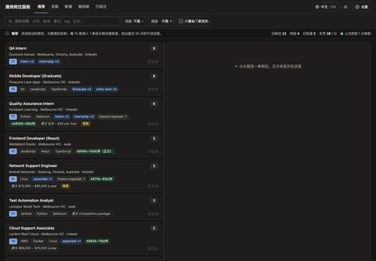
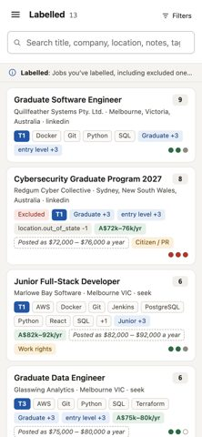
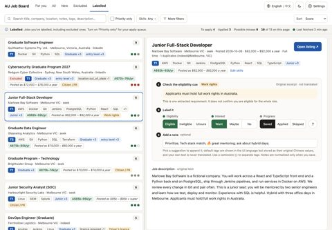
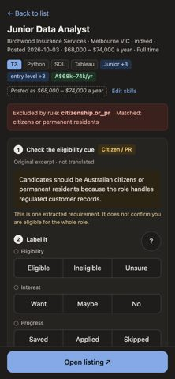
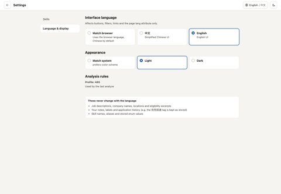
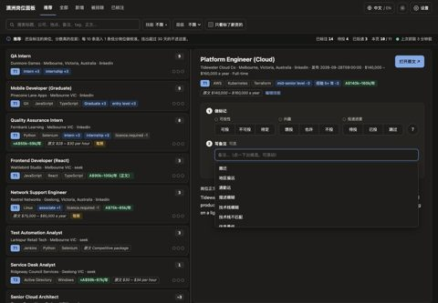
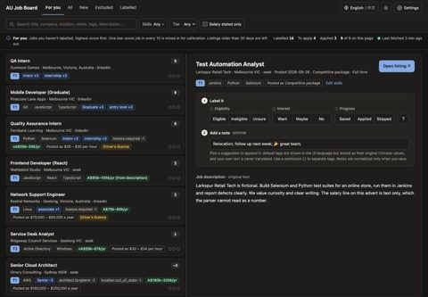

# Synthetic screenshot library

102 original PNG screenshots of the job panel running **normally** (`jobs.cli panel`,
no Demo mode, no Demo banner) on a hand-written synthetic mock database. The panel
code comes from two versions, recorded per image in `index.json` as `source_commit`:
95 images were shot at `f304d0d19669313764419fe1c025be7c6fe53803` (e5a5582 plus the English salary-chip and
empty-description fixes); 7 images (English multi-tag notes) were re-shot at
`847af8bafdac122de68f7dea1318bc08241c32cc`, which adds `; ` between English note tags.
Everything shown is fictional; no real postings, notes, companies or configuration.

- Originals: [`images/`](images) (full resolution, never cropped or re-encoded).
- Thumbnails: [`thumbs/`](thumbs) · contact sheets: [`contact/`](contact).
- Per-image metadata (scene, language, theme, viewport, scale, SHA256, bytes): [`index.json`](index.json).
- What is covered / skipped: [`coverage.md`](coverage.md).

File names: `<group>-<scene>-<lang>-<theme>-<device>-<viewport>.png` with group
A main views, B settings, C job detail, D interactions and edge cases.

## Suggested picks

| Image | What it shows |
|---|---|
|  | Recommended view, English, light, desktop |
|  | Recommended view, Chinese, dark, desktop |
|  | Labelled view, phone width |
|  | Labelled job detail: status, default + custom + emoji note tags |
|  | Excluded job detail with rule and original-text evidence, phone |
|  | Settings: language, appearance and read-only analysis Profile 485 |
|  | Note suggestions (Chinese defaults) |
|  | Multi-tag note with emoji after reload |

## How they were produced (historical)

Each screenshot was captured from a fresh synthetic mock root that a maintainer
built and served with the ordinary `jobs.cli panel` entry, then recorded
with a Playwright-driven Chromium-family browser at the viewports above. The mock
builder and capture tools are maintainer tools: they are **not** part of the
public candidate and no reproduction commands are shipped here.

The mock inputs that ship with the project are in [`mock-inputs/`](mock-inputs)
plus `demo/demo.jobs.json` (existing fixture, unchanged). Interaction shots
at the end of the capture run saved labels, notes and one skill into the mock root
only; those records carry `mutated_before: true` in `index.json`. A re-run
would have needed a new root.

## Browser and method

Brave 154 (Chromium) headless, driven by Playwright. Viewports are CSS-pixel emulations
(desktop 1440x1000 @1x, phone 390x844 @2x touch, tablet 768x1024 @2x), **not** physical
devices. Language and theme are set by the panel's own cookies. Animations stay on; each
shot waits for fonts, network idle and a settle delay. Nothing is composed or edited.
